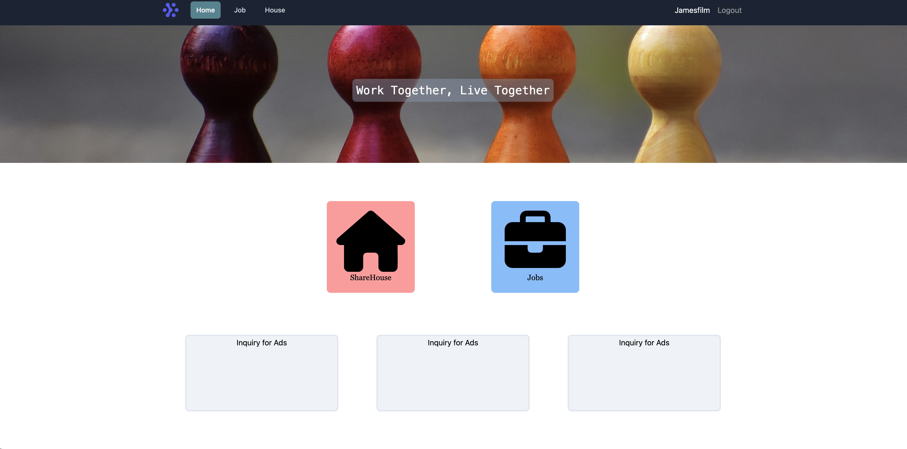

<!-- prettier-ignore-start -->

# MERN stack commnitywebsite using google-oauth & AWS s3

A simple MERN stack app using google-oauth & AWS s3

⌛️ 01.08.2022 ~ ing

💻 Tech used:

- React
- Redux-toolket
- Tailwind
- Nodejs
- Express
- MongoDB
- AWS S3

🌎 Live demo: https://mern-communitywebsite.herokuapp.com/

📋 TODO:

- [x] ~~Add resize image function before upload~~(03.09.2022)
  - Sharp library to resize image(640*480, jpeg)
  - Set upload size limit to 2MB
- [x] ~~Add pagination (Job & House pages)~~(08.09.2022)
- [x] ~~Create Profile page~~(14.09.2022)
  - Add link for user posts / show posts numbers
- [x] ~~Add search function for Job page~~(17.09.2022)
  - Add search bar in Job Page
- [x]~~Update login cookie session~~(21.09.2022)
  - Add Redis for session management
  - Set maxAge for session expire & rolling:true for refresh session
- [ ] Update UI (favicon, logo, etc.)
<!-- prettier-ignore-end -->
